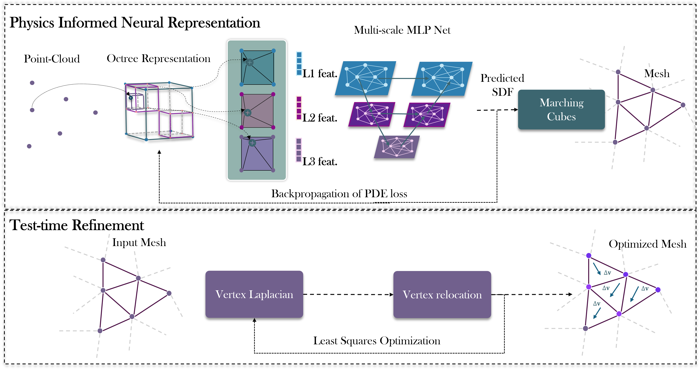

# HessianForge: Scalable LiDAR reconstruction with Physics-Informed Neural Representation and Smoothness Energy Constraints
### Hrishikesh Viswanath, Md Ashiqur Rahman, Chi Lin, Damon Conover, Aniket Bera

This is the implementation for the methods presented in the paper: [Arxiv](https://arxiv.org/abs/2503.08929)

---
## Abstract
Accurate and efficient 3D mapping of large-scale outdoor environments from LiDAR measurements is a fundamental challenge in robotics, particularly towards ensuring smooth and artifact-free surface reconstructions. Although the state-of-the-art methods focus on memory-efficient neural representations for high-fidelity surface generation, they often fail to produce artifact-free manifolds, with artifacts arising due to noisy and sparse inputs. To address this issue, we frame surface mapping as a physics-informed energy optimization problem, enforcing surface smoothness by optimizing an energy functional that penalizes sharp surface ridges. Specifically, we propose a deep learning based approach that learns the signed distance field (SDF) of the surface manifold from raw LiDAR point clouds using a physics-informed loss function that optimizes the L2-Hessian energy of the surface. Our learning framework includes a hierarchical octree based input feature encoding and a multi-scale neural network to iteratively refine the signed distance field at different scales of resolution. Lastly, we introduce a test-time refinement strategy to correct topological inconsistencies and edge distortions that can arise in the generated mesh. We propose a CUDA-accelerated least-squares optimization that locally adjusts vertex positions to enforce feature-preserving smoothing. We evaluate our approach on large-scale outdoor datasets and demonstrate that our approach outperforms current state-of-the-art methods in terms of improved accuracy and smoothness.

---


## 🔧 Installation

### 1. [Install ROS2 ](https://docs.ros.org/en/humble/Installation.html)  (Optional)

#### Setup ROS2 Humble
```bash
sudo apt install software-properties-common
sudo add-apt-repository universe
sudo apt update && sudo apt install curl -y
curl -sSL https://raw.githubusercontent.com/ros/rosdistro/master/ros.key | sudo tee /usr/share/keyrings/ros-archive-keyring.gpg > /dev/null
echo "deb [signed-by=/usr/share/keyrings/ros-archive-keyring.gpg] http://packages.ros.org/ros2/ubuntu $(. /etc/os-release && echo "$UBUNTU_CODENAME") main" | sudo tee /etc/apt/sources.list.d/ros2.list > /dev/null
```

```bash
sudo apt update
sudo apt install ros-humble-desktop
```

```bash
sudo apt install python3-colcon-common-extensions
```


### 2. Create and Activate Conda Environment
```bash
conda create -n hessian python=3.10
conda activate hessian
```

### 3. Install Dependencies
```bash
conda install nvidia/label/cuda-12.4.0::cuda
pip install torch==2.5.1 torchvision==0.20.1 torchaudio==2.5.1 --index-url https://download.pytorch.org/whl/cu124
pip install kaolin==0.17.0 -f https://nvidia-kaolin.s3.us-east-2.amazonaws.com/torch-2.5.1_cu124.html
pip install open3d scikit-image wandb tqdm natsort pyquaternion
pip install pyyaml requests importlib_metadata pytz pygments pybind11
pip install decorator pexpect

```

---

## Prepare Data

Download Maicity, Kitti, NewerCollege dataset through command:

```bash
sh ./scripts/download_maicity.sh #download maicity dataset
sh ./scripts/download_kitti_example.sh #download kitti dataset
sh ./scripts/download_ncd_example.sh #download newer college dataset
```

---

## Run

We take the Kitti dataset as an example to show how HessianForge works. You can replace kitti with your dataset name in the config file path, such as ./config/[dataset]/[dataset]_[xxx].yaml.

The results will be stored with your experiment name with the starting timestamp in the output_root directory as what you set in the config file. You can find the reconstructed mesh (*.ply format) and optimized model in mesh and model folder, respectively. If the save_map option is turned on, then you can find the grid sdf map in map folder.

For mapping based on offline batch processing, use:
```python
python hessianforge_batch.py ./config/kitti/kitti_batch.yaml
```

For incremental mapping with replay strategy (within a local bounding box), use:
```python
python hessianforge_incre.py ./config/maicity/maicity_incre_replay.yaml
```

For incremental mapping with a regularization strategy, use:
```python
python hessianforge_incre.py ./config/kitti/kitti_incre_reg.yaml
```

For ros2 support, use:
```python
python hessianforge_batch_ros2.py ./config/kitti/kitti_batch.yaml
```
```python
python hessianforge_incre_ros2.py ./config/kitti/kitti_batch.yaml
```

## Sample Result


---

## 🐞 Common Issues

### Missing Python Modules
If errors like `ModuleNotFoundError` occur:
- Confirm the correct Python is used: `which python`
- Add the Conda `site-packages` to `sys.path` inside the ROS 2 script:

```python
import sys
sys.path.append("/home/user/miniconda3/envs/shine/lib/python3.10/site-packages")
```

### GLIBCXX_3.4.30 not found
ROS 2 is compiled against the system's GCC, but Conda overrides the libstdc++.so.6 with an older version.

Let Conda to use system’s libstdc++.so.6, run:
```bash
export LD_PRELOAD=/usr/lib/x86_64-linux-gnu/libstdc++.so.6
```

---

## 🔍 Troubleshooting Tips
- Always source the workspace: `source /opt/ros/humble/setup.bash`
- Check Python version inside script with print(sys.executable) to debug environments


## Citation

```bash
@article{viswanath2025hessianforge,
  title={HessianForge: Scalable LiDAR reconstruction with Physics-Informed Neural Representation and Smoothness Energy Constraints},
  author={Viswanath, Hrishikesh and Rahman, Md Ashiqur and Lin, Chi and Conover, Damon and Bera, Aniket},
  journal={arXiv preprint arXiv:2503.08929},
  year={2025}
}
```

## Related Papers

This codebase has been built using the opensource contributions of the following works

- [SHINE](https://github.com/PRBonn/SHINE_mapping) (Train setup, Octree implementations, Comparison Baseline)
- [3QFP](https://github.com/ljjTYJR/3QFP) (Comparison Baseline)
- [NKSR](https://github.com/nv-tlabs/NKSR) (Comparison Baseline)
- [NGLOD](https://github.com/nv-tlabs/nglod) (octree based hierarchical feature structure built based on [kaolin](https://kaolin.readthedocs.io/en/latest/index.html)) 
- [VDBFusion](https://github.com/PRBonn/vdbfusion) (comparison baseline)
- [Voxblox](https://github.com/ethz-asl/voxblox) (comparison baseline)
- [Puma](https://github.com/PRBonn/puma) (comparison baseline and the MaiCity dataset)
- [KISS-ICP](https://github.com/PRBonn/kiss-icp) (simple yet effective pose estimation)
